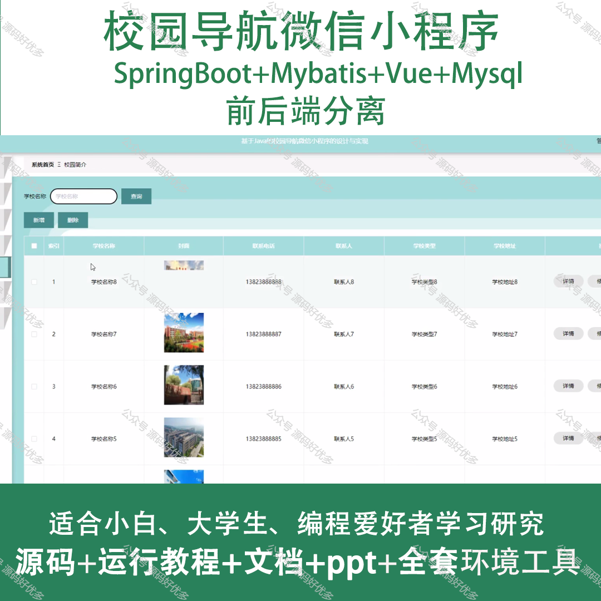
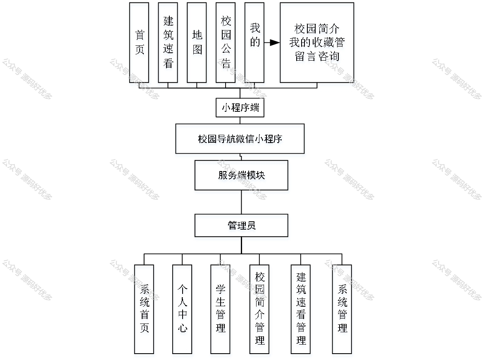
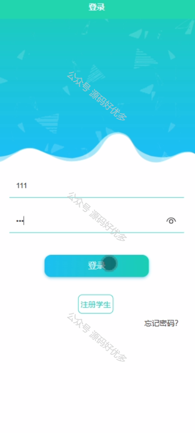
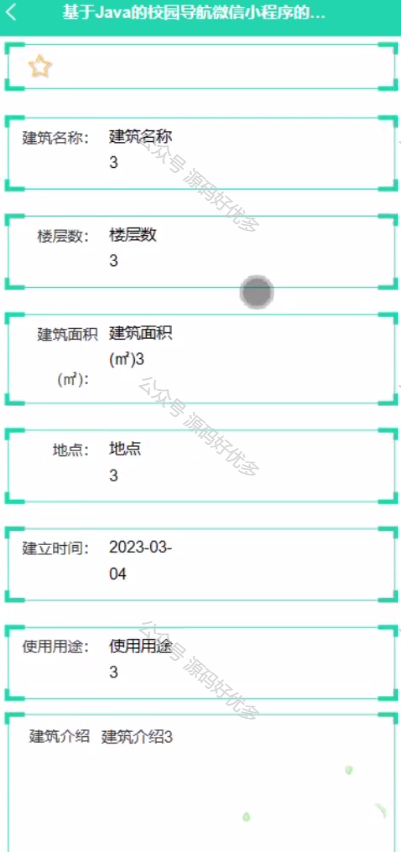
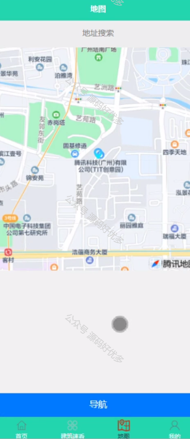
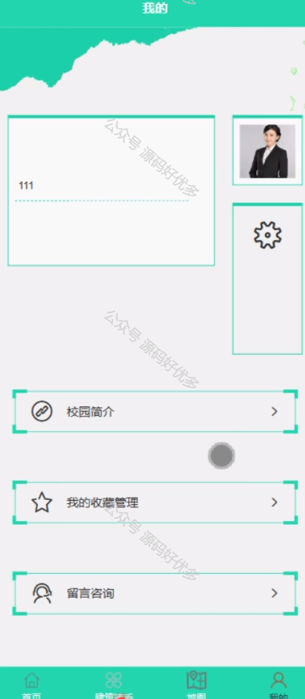
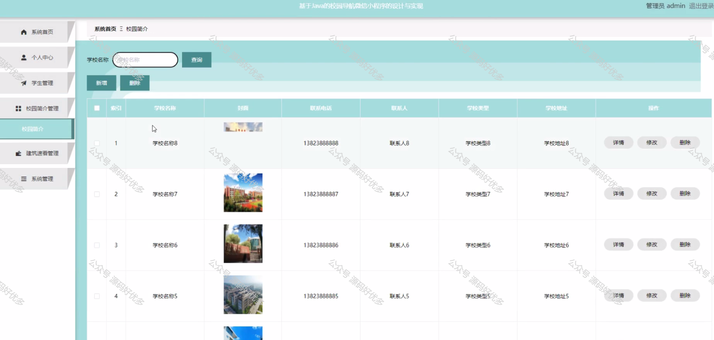
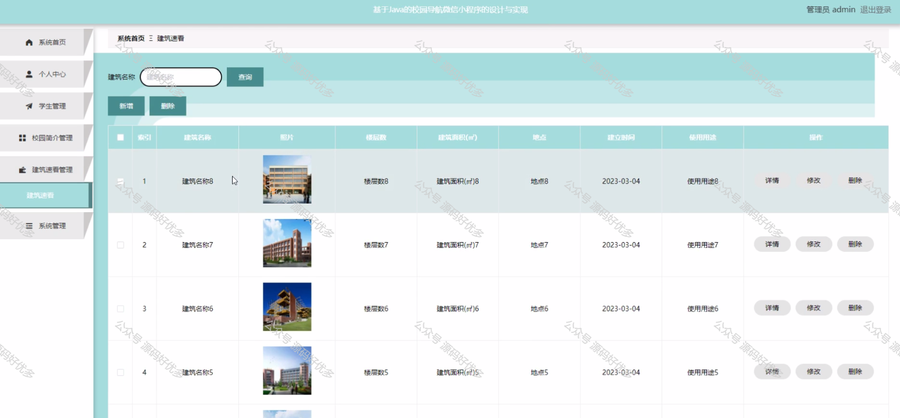
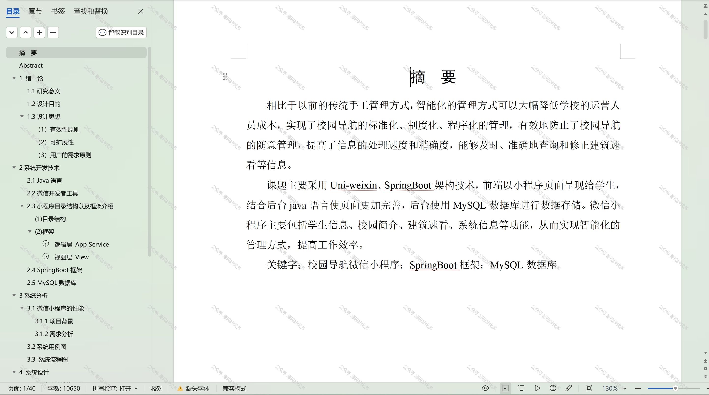

 
## 查看主页获取源码

> **作者介绍**： **✌**全网粉丝10W+本平台特邀作者、博客专家、CSDN新星计划导师、java领域优质创作者,博客之星、掘金/华为云/阿里云/InfoQ等平台优质作者、专注于项目实战 **✌**

  

### 一、作品包含

源码+数据库+设计文档万字+PPT+全套环境和工具资源+部署教程

### 二、项目技术

前端技术：Html、Css、Js、Vue、Element-ui

数据库：MySQL

后端技术：Java、Spring Boot、MyBatis

  

### 三、运行环境

开发工具：IDEA/eclipse + 微信开发者工具

数据库：MySQL5.7

数据库管理工具：Navicat10以上版本

环境配置软件： JDK1.8+Maven3.6.3

前端Nodejs：14

### 四、项目介绍
项目编号：mpweixinA049

校园导航微信小程序以解决校园内师生及访客在大型或复杂校园环境中容易迷路的问题为背景，提供精准的室内外导航服务。通过集成校园地图、教学楼定位、活动路线规划等功能，该小程序旨在提升校园内的移动便捷性，增强校园生活体验，同时促进校园信息的数字化和智能化。

前台用户功能：首页、建筑速看、地图、校园公告、校园简介、我的收藏管理、留言咨询。

后台管理员的功能：系统首页、个人中心、学生管理、校园简介管理、建筑速看管理、系统管理。

### 五、运行截图

  
